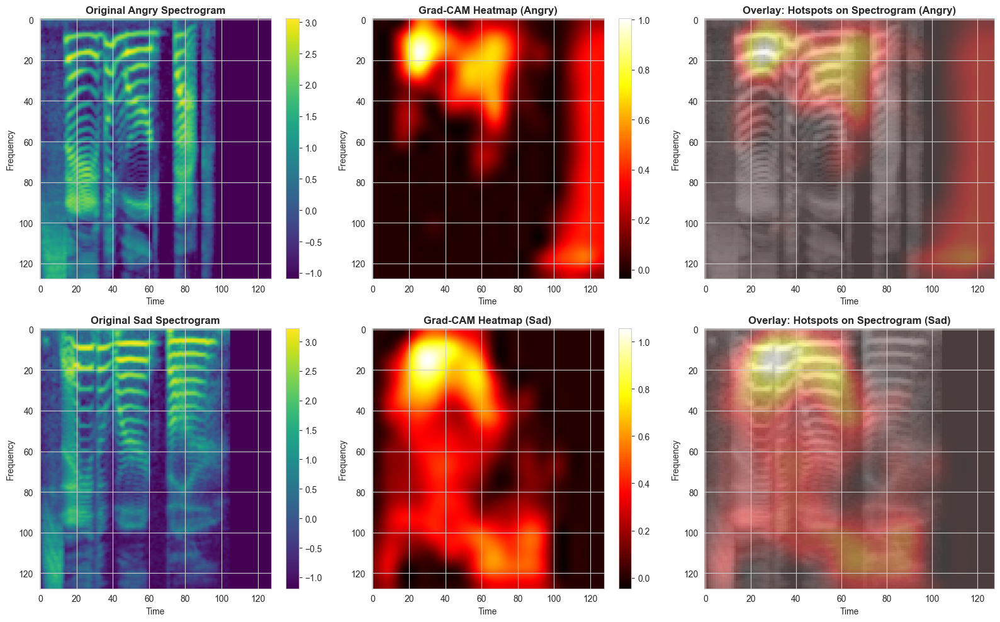

# speech-emotion-gradcam

Speech emotion recognition on the **Toronto Emotional Speech Set (TESS)** using log-mel spectrograms and a **2-D CNN**, with **Grad-CAM** explanations and an optional **TTS** inference demo. A separate **text** track uses Whisper transcripts to show why lexical content alone is insufficient for TESS.

---

## Research summary

### Problem and motivation

TESS provides acted emotional speech from **two speakers** (Older Adult Female **OAF**, Young Adult Female **YAF**) with **fixed sentence content** repeated across emotions. Prosody carries emotion; transcript text is largely shared. Naive **random train/test splits** leak information: the same sentence under different emotions can appear in both train and test, and speaker identity is mixed, so reported accuracy can approach **100%** while **generalization** to unseen speakers or strictly held-out linguistic content is not measured.

### Real-life scenario: train on OAF, validate on YAF

By default we **do not mix speakers** in training versus tuning. **All Older Adult Female (OAF) clips are used for training** (with on-the-fly augmentation). **All Young Adult Female (YAF) clips are used only as held-out data**: the same YAF tensors serve as **`validation_data` during `model.fit`** (early stopping, checkpoint, learning-rate schedule) **and** as the **test set** in the evaluation notebook. The model never sees YAF spectrograms in gradient updates—only OAF—so metrics reflect **cross-speaker generalization**, analogous to building a system on one voice profile and measuring performance on **another speaker**, which is much closer to a **realistic deployment** question than a random split on pooled OAF+YAF data.

**Train/test size (speaker mode):** this is **not** a 70/30 split. With standard TESS balance you get **one full speaker vs the other** — typically **~50% / ~50%** of all clips (e.g. 1400 OAF train / 1400 YAF eval). The **`test_size=0.3`** argument in code applies only to **`sentence_group`** and **`random`** modes, not to **`speaker`**.

### What we implemented (audio track)

| Topic | Approach |
|--------|-----------|
| **Evaluation protocol** | Default **speaker-independent split** (`TESS_SPLIT_MODE=speaker`): **train = OAF only**; **validation and reported test = YAF only** (same YAF hold-out for `fit` callbacks and for notebook evaluation). Optional `sentence_group` or `random` for ablations only. |
| **Features** | Librosa **mel-spectrogram** → dB → pad/crop to **128×128**, **per-clip z-score** after dB. Pickle stores `features`, `labels`, `speakers`, `sentence_groups`, `label_encoder`, `emotion_list`. |
| **Architecture** | Four conv blocks with filters **16→32→64→128**, **L2(5e-4)** on convs, **BatchNorm**, **GlobalAveragePooling**, **Dense(128)+Dropout**, softmax head. |
| **Optimization** | **Adam lr=3e-4**, **sparse CE + label smoothing 0.1** (custom `SparseCategoricalCrossentropyWithLabelSmoothing` for Keras builds without native `label_smoothing` on sparse loss). |
| **Regularization** | Dropout, L2, label smoothing; **gentle SpecAugment-style** augmentation (time/freq masks + Gaussian noise). |
| **Augmentation** | **`tf.data`** pipeline: **fresh random augmentation every epoch** on training only; validation uses **unmodified** spectrograms. |
| **Training control** | **ModelCheckpoint** (best `val_accuracy`), **EarlyStopping** (patience **25**, restore best weights), **ReduceLROnPlateau** (patience **8**, `min_lr=1e-6`). Up to **100** epochs in `main()`. |
| **Reproducible evaluation** | `train.py` writes **`tess_eval_split.npz`** (train/test indices + split mode) next to `tess_features.pkl`; **`evaluate_model.ipynb`** reloads the **same** rows as training—no second random split. |
| **Inference** | `load_model` strips unsupported **`quantization_config`** from saved configs when needed, then **recompiles** with the same loss/lr for stable `evaluate` / `predict`. |

### Reported results (speaker split: OAF train, YAF test)

These numbers come from the strict evaluation setup above (see also figures under **Visualizations**).

| Metric | Value |
|--------|--------|
| **Overall accuracy** | **77.21%** |
| **Test loss** | **1.2410** |

**Per-emotion accuracy (YAF test):**

| Emotion | Accuracy |
|---------|----------|
| angry | 64.00% |
| disgust | 92.50% |
| fear | 100.00% |
| happy | 0.00% |
| neutral | 100.00% |
| pleasant_surprise | 98.50% |
| sad | 85.50% |

#### Why is **happy** at **0%** on YAF (not a “bug” in the metric)?

Per-emotion accuracy here means: among all YAF test clips whose **true** label is *happy*, what fraction did the model **predict** as *happy*? **0%** means **no** YAF *happy* file was classified with *happy* as the argmax class—those samples were almost entirely assigned to **other** emotions (see the **confusion matrix** figure: the row for true *happy* will show which classes absorbed them). That is a **model + data phenomenon**, not an evaluation script error.

Plausible reasons under an **OAF train / YAF test** protocol:

1. **Cross-speaker emotion “shape”** — *Happy* for YAF may look in mel space more like another class the model learned from OAF (e.g. **angry** or **pleasant_surprise**: higher pitch / energy overlap), so the decision boundary never assigns the *happy* logit highest on YAF.
2. **Only ~200 YAF test clips per class (TESS balance)** — one brittle class can collapse to 0% recall while overall accuracy stays moderate (~77%).
3. **Acting and recording differences** — OAF “happy” prosody may not transfer to how YAF realizes “happy” in the same sentences, so the CNN’s OAF-biased features under-represent the YAF happy manifold.

So the takeaway is: **speaker-general recognition is hard for some emotions**; *happy* is the clearest failure mode in this run. Retraining with swapped speakers (YAF train, OAF test), class weights, focal loss, or more data would be natural next experiments—not reverting to a leaky random split to “fix” the number.

### Visualizations

Static figures (commit under `audio_analysis/visualization/`):




---

## Repository layout

| Path | Role |
|------|------|
| `audio_analysis/data_processing/feature_extraction.py` | TESS scan → mel tensors → **`tess_features.pkl`** (+ speaker / sentence group metadata). |
| `audio_analysis/train.py` | Split, datasets, augmentation, fit, **`best_model.h5`**, **`tess_eval_split.npz`**. |
| `audio_analysis/models/build_cnn.py` | CNN definition, custom label-smoothed loss, **`compile_model`**. |
| `audio_analysis/inference.py` | Load model, preprocess (match training), predict, Grad-CAM, TTS helper. |
| `audio_analysis/evaluate_model.ipynb` | Same split as training; metrics, plots, Grad-CAM. |
| `audio_analysis/inference_demo.ipynb` | Single-file demo: prediction, confidence, TTS, Grad-CAM. |
| `audio_analysis/visualization/` | Exported figures for README / reports. |
| `data/` | TESS-style layout (`OAF_emotion/`, `YAF_emotion/`, …). Not committed if listed in `.gitignore`. |
| `text_analysis/` | Exploratory **lexical baseline**: Whisper → CSV → TF-IDF + Naive Bayes (see below). |

---

## Setup

```bash
pip install -r requirements.txt
```

Place TESS audio under `data/` (see layout above).

---

## Audio pipeline (commands)

**1. Feature extraction**

The script writes `tess_features.pkl` relative to your **current working directory**. To match where `train.py` looks by default (`audio_analysis/data_processing/tess_features.pkl` when the repo root is cwd), run from that folder:

```bash
cd audio_analysis/data_processing
python feature_extraction.py
```

Alternatively, run from anywhere but move/rename the pickle to `audio_analysis/data_processing/tess_features.pkl`, or rely on `train.py` path resolution if you keep one canonical copy there.

Output (recommended location): `audio_analysis/data_processing/tess_features.pkl`

**2. Training** (from repo root or `audio_analysis/`, paths auto-resolve)

```bash
python audio_analysis/train.py
```

With the default split (**real-life style**): **optimization uses OAF only**; **validation accuracy / loss are computed on YAF only** (held-out speaker), so checkpointing and early stopping target **generalization to the second speaker**, not memorization of YAF.

Optional: `TESS_SPLIT_MODE=speaker` (default) | `sentence_group` | `random`

Outputs:

- **`best_model.h5`** — saved in the **shell’s current working directory** when you launch training (Keras `ModelCheckpoint` is relative to cwd; e.g. `cd audio_analysis` then `python train.py` → `audio_analysis/best_model.h5`).
- **`tess_eval_split.npz`** — always next to the resolved features pickle (typically `audio_analysis/data_processing/tess_eval_split.npz`).

**3. Evaluation**

Open `audio_analysis/evaluate_model.ipynb` (set kernel cwd to **`audio_analysis`** so `from train import …` and `from inference import …` resolve). Requires the pickle, split npz, and `best_model.h5` from the same training run.

**4. Inference demo**

Open `audio_analysis/inference_demo.ipynb`; set **`audio_path`** to a `.wav` under `data/`. Uses relative resolution for project root vs `audio_analysis/` cwd.

---

## Text analysis track (experiment only)

We added a small **text** branch **only as a controlled experiment**: *can emotion be predicted from words alone on TESS?* It is **not** meant to compete with the audio model; it answers a **research design** question about what signal remains after ASR.

**Pipeline:**

1. **`extract_transcript.py`** — runs **OpenAI Whisper** on each WAV and returns plain text (word content; **no** pitch, timing, or stress).
2. **`csv_generator.py`** — writes **`tess_metadata.csv`**: path, speaker, emotion, transcript.
3. **`text_emotion_analysis.ipynb`** — **TF–IDF** bag-of-words + **Multinomial Naive Bayes** (classic lexical classifier) with a conventional train/test split on rows.

**Why this experiment matters for TESS:**

Across emotions, the **same underlying sentences** are spoken; only **delivery** changes. Whisper therefore yields **near-identical transcripts** for angry vs happy vs sad versions of the same line. The feature space is almost **emotion-orthogonal**: word counts barely differ by label, so the classifier has **little discriminative text signal**.

**Outcome:** the lexical classifier performs **poorly** on this task—consistent with **you cannot predict TESS emotion reliably from words alone** after ASR. (The notebook uses its **own** train/test split on transcript rows; it is **not** forced to match the OAF/YAF speaker protocol, but the conclusion still holds: **shared wording** leaves almost no text signal.) Emotion lives in **how** things are said (**acoustic / prosodic** cues), which is what the mel + CNN pipeline targets. The text track **supports** investing in audio features + Grad-CAM rather than transcripts-only models.

---

## References (informal)

- **TESS:** Toronto Emotional Speech Set (two actresses, English sentences × emotions).
- **Grad-CAM:** Selvaraju et al., “Grad-CAM: Visual Explanations from Deep Networks.”
- **SpecAugment:** Park et al., “SpecAugment: A Simple Data Augmentation Method for ASR.”

---

## License / attribution

Use TESS according to its original terms. This repository documents a student/research-style pipeline for reproducibility and education.
